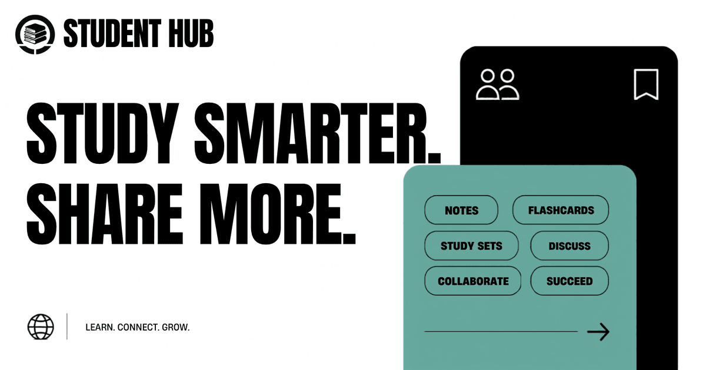

#  Student Hub

**Study Smarter. Share More.**



## About

Every university student knows the problem: course material lives everywhere and nowhere — WhatsApp groups, Drive folders, a senior's laptop that graduated two years ago. Each semester, students re-solve the same hunt for reliable notes and past papers.

**Student Hub** consolidates that knowledge into one searchable, community-driven library. Students upload what they have — lecture notes, past papers, quizzes, assignments — organized by subject, resource type, department, and professor, and find what others have shared in seconds. Likes, downloads, and community reports keep quality honest; verified accounts, a DMCA takedown workflow, and academic-integrity policies keep the platform trustworthy.

**Who it's for**

- **Students** — free, searchable access to real course material shared by peers, on any device (installs as a PWA and works offline)
- **Contributors** — upload once, help every batch that follows; duplicate detection warns you if similar material already exists
- **Admins & moderators** — reports queue, content management, IP/attack controls, and a contact inbox in a single panel

Designed for students, by students — the tagline isn't decoration; the whole product follows it.

---

##  Features

###  Core
- **Resource Sharing** — Upload and download study materials (PDF, DOCX, images)
- **Smart Search** — Find resources by subject, type, department, or professor
- **Duplicate Detection** — Warns uploaders when similar resources already exist
- **Like & Download** — Track engagement and popularity
- **Content Reporting** — Community-driven quality control

###  Security
- **Attack Detection** — Auto-blocks SQL injection, XSS, path traversal, and known scanner bots
- **Behavior, not tools** — VPN/proxy use is permitted; only attack behavior triggers blocking
- **Rate Limiting** — Prevents brute force attacks on login, signup, and uploads
- **IP Blocking** — Manual and automatic IP blocking with admin unblock
- **Security Headers** — HSTS, CSP, X-Frame-Options, and more

###  Admin Panel
- **Security Tab** — View and manage blocked IPs (attack, manual)
- **Resources Tab** — Edit or delete any resource across the platform
- **Reports Tab** — Review user reports, delete offending content
- **Messages Tab** — Read contact form submissions
- **Admins Tab** — Manage admin access by email

###  Design
- **Brutalist UI** — Bold borders, sharp shadows, clean typography
- **Fully Responsive** — Works on mobile, tablet, and desktop
- **Skeleton Loading** — Smooth loading states for every page
- **Error Handling** — Custom error pages for every route
- **PWA Support** — Works offline with service worker caching

###  Authentication
- **Email/Password** — Secure bcrypt hashing with strength requirements
- **GitHub OAuth** — One-click login with GitHub
- **Session Management** — JWT-based sessions with Auth.js

---

##  Tech Stack

| Layer | Technology |
|-------|-----------|
| **Framework** | [Next.js 16](https://nextjs.org/) (App Router + Turbopack) |
| **Language** | [TypeScript](https://www.typescriptlang.org/) |
| **Styling** | [Tailwind CSS 4](https://tailwindcss.com/) |
| **Database** | [Neon PostgreSQL](https://neon.tech/) |
| **ORM** | [Drizzle ORM](https://orm.drizzle.team/) |
| **Auth** | [Auth.js](https://authjs.dev/) (NextAuth v5) |
| **Storage** | [Cloudflare R2](https://www.cloudflare.com/products/r2/) |
| **Validation** | [Zod](https://zod.dev/) |
| **Deployment** | [Vercel](https://vercel.com/) |

---

##  Getting Started

### Prerequisites
- Node.js 20.9+ (CI runs on Node 22)
- A [Neon](https://neon.tech) account (free)
- A [Cloudflare](https://cloudflare.com) account (free)
- A [GitHub](https://github.com) OAuth app

### 1. Clone the repository
```bash
git clone https://github.com/studenthub268/student-hub.git
cd student-hub
```

### 2. Install dependencies
```bash
npm install
```

### 3. Set up environment variables
```bash
cp .env.example .env.local
```

Fill in your values:

```env
DATABASE_URL=your_neon_connection_string
AUTH_SECRET=your_generated_secret
AUTH_URL=http://localhost:3000
APP_URL=http://localhost:3000
GITHUB_CLIENT_ID=your_github_client_id
GITHUB_CLIENT_SECRET=your_github_client_secret
GOOGLE_CLIENT_ID=your_google_client_id
GOOGLE_CLIENT_SECRET=your_google_client_secret
R2_ACCOUNT_ID=your_cloudflare_account_id
R2_ACCESS_KEY_ID=your_r2_access_key
R2_SECRET_ACCESS_KEY=your_r2_secret_key
R2_BUCKET_NAME=student-hub-files
R2_PUBLIC_URL=your_r2_public_url
RESEND_API_KEY=your_resend_api_key
EMAIL_FROM=Student Hub <noreply@yourdomain.com>
RESEND_WEBHOOK_SECRET=your_resend_webhook_secret
```

### 4. Set up the database
Apply the migrations in `drizzle/` (e.g. `npm run db:migrate`) or generate fresh ones from the schema with `npm run db:generate`.

### 5. Start the dev server
```bash
npm run dev
```

Open [http://localhost:3000](http://localhost:3000).

---

##  Project Structure

```
student-hub/
├── app/                    # Next.js App Router pages
│   ├── admin/              # Admin panel
│   ├── api/                # API routes
│   ├── auth/               # Password reset flow
│   ├── browse/             # Browse all resources
│   ├── contact/            # Contact form
│   ├── find/               # Search page
│   ├── login/              # Login page
│   ├── resource/           # Resource detail page
│   ├── signup/             # Signup page
│   ├── terms/              # Terms & privacy
│   ├── upload/             # Upload form
│   ├── offline/            # Offline fallback page
│   ├── not-found.tsx       # 404 page
│   ├── error.tsx           # Global error boundary
│   ├── loading.tsx         # Global loading skeleton
│   ├── robots.ts           # SEO robots
│   └── sitemap.ts          # SEO sitemap
├── components/             # React components
│   ├── auth/               # Login & signup forms
│   ├── layout/             # Navbar, Footer, AdminLink
│   ├── resources/          # ResourceCard, RecentResources
│   └── ui/                 # Skeleton, LiveStats
├── lib/                    # Server-side utilities
│   ├── actions/            # Server actions (auth, resources, admin)
│   ├── db/                 # Database schema & connection
│   ├── auth.ts             # Auth.js configuration
│   ├── ip-block.ts         # IP blocking & attack detection
│   ├── r2.ts               # Cloudflare R2 client
│   └── constants.ts        # Subjects, departments, types
├── public/                 # Static assets
│   ├── sw.js               # Service worker (offline)
│   ├── manifest.json       # PWA manifest
│   └── og-image.png        # Open Graph image
├── proxy.ts                 # Auth, security, IP blocking
└── next.config.ts          # Next.js configuration
```

---

##  Security Features

| Feature | Description |
|---------|-------------|
| **SQL Injection Protection** | Drizzle ORM parameterized queries |
| **XSS Prevention** | Input sanitization, no `dangerouslySetInnerHTML` |
| **CSRF Protection** | Auth.js built-in CSRF tokens |
| **Rate Limiting** | Login (10/15min), Signup (5/hr), Upload (20/hr) |
| **Password Hashing** | bcrypt with 12 salt rounds |
| **Auto IP Blocking** | Detects and blocks attack patterns instantly (VPN/proxy use never blocks) |
| **Security Headers** | HSTS, X-Frame-Options, CSP, Referrer-Policy |
| **Bot Blocking** | Blocks SQLMap, Nikto, NMap, and other scanners |

---

##  Testing & CI

The full quality gate is one command:

```bash
npm run preflight   # ESLint → tsc --noEmit → 3-phase smoke suite
```

The smoke suite (`scripts/smoke-browse.mjs`) runs against a **live server + database**:

1. **HTTP/SSR phase** — result counts and filter-pill badges cross-checked against the database, route guards, faceted filtering
2. **UI phase** — headless Chrome (via `playwright-core`, driving your installed system Chrome; override with `CHROME_PATH`) reads badges from the real DOM, clicks pills, verifies debounced search fires exactly one request
3. **Auth phase** — signup → DB token verification → blocked login while unverified → verify link → login → navbar → sign-out, then cleans up its test user (`SMOKE_SKIP_AUTH=1` to skip)

All phases are **DB-state agnostic**: with an empty database they assert the empty state and skip the data-dependent checks; with real resources they validate against live counts. No fixtures are seeded.

Useful scripts:

```bash
npm run smoke                       # smoke suite only (expects a server on :3000)
```

CI (`.github/workflows/ci.yml`) runs the same gate on every push/PR: lint → typecheck → production build → `next start` → smoke suite. Required repo secrets: `DATABASE_URL`, `AUTH_SECRET`.

---

##  Deployment

Full step-by-step guide: **[DEPLOYMENT.md](./DEPLOYMENT.md)** — importing the repo into Vercel, all required environment variables, OAuth callback URLs, migrations, and a post-deploy checklist.

This project is optimized for [Vercel](https://vercel.com):

```bash
npm run build
```

Or deploy directly from GitHub — every push to `main` auto-deploys.

### Environment Variables for Production
Set these in Vercel Dashboard → Settings → Environment Variables:

| Variable | Description |
|----------|-------------|
| `DATABASE_URL` | Neon PostgreSQL connection string |
| `AUTH_SECRET` | Random secret for Auth.js |
| `AUTH_URL` | Your production URL |
| `GITHUB_CLIENT_ID` | GitHub OAuth client ID |
| `GITHUB_CLIENT_SECRET` | GitHub OAuth client secret |
| `R2_ACCOUNT_ID` | Cloudflare account ID |
| `R2_ACCESS_KEY_ID` | R2 access key |
| `R2_SECRET_ACCESS_KEY` | R2 secret key |
| `R2_BUCKET_NAME` | R2 bucket name |
| `R2_PUBLIC_URL` | R2 public bucket URL |
| `APP_URL` | Public app URL for email links (server-side only) |
| `RESEND_API_KEY` | Resend API key for transactional email |
| `EMAIL_FROM` | Verified sender address for emails |
| `RESEND_WEBHOOK_SECRET` | Resend webhook secret |
| `GOOGLE_CLIENT_ID` | Google OAuth client ID (optional) |
| `GOOGLE_CLIENT_SECRET` | Google OAuth client secret (optional) |

---

##  License

MIT License — feel free to use this project for your own student platform.

---

##  Acknowledgments

Built with ❤️ for students everywhere. Share knowledge, help each other succeed.

---

<p align="center">
  <strong>Study Smarter. Share More.</strong><br>
  <a href="https://student-hub-uet.vercel.app">Live Demo</a> · 
  <a href="https://github.com/studenthub268/student-hub/issues">Report Bug</a> · 
  <a href="https://github.com/studenthub268/student-hub/pulls">Contribute</a>
</p>
