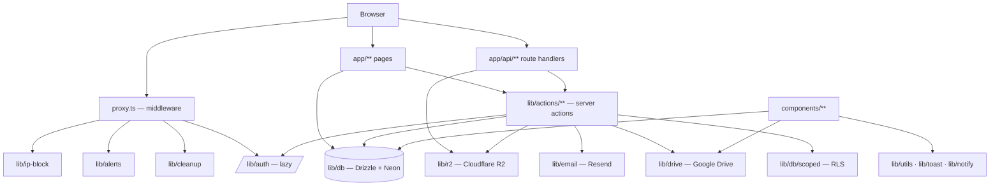

# 🧠 brain.md — Student Hub Codebase Map

> **Purpose:** a one-stop, always-current memory of how this codebase is wired, so a
> human or an AI agent can orient in seconds and make safe changes.
>
> **Keep it fresh:** run `npm run brain` to regenerate the machine-readable graph
> (`brain.graph.json`, `brain.graph.mmd`) after moving/adding modules, then paste the
> Mermaid block below if it changed. Everything else here is hand-maintained.

Tagline: **"Study Smarter. Share More."** — a peer-powered academic resource-sharing
platform where university students upload, browse, search, filter, like, download and
report study materials (notes, past papers, quizzes, assignments).

---

## 1. Tech stack

| Layer | Choice |
|-------|--------|
| Framework | **Next.js 16** (App Router, Turbopack) + **React 19** |
| Language | **TypeScript** (strict) |
| Styling | **Tailwind CSS v4** (CSS-first, `@tailwindcss/postcss`; no `tailwind.config`) |
| Fonts | Geist / Geist Mono via `next/font/google` (weights 400/500/700) |
| Database | **Neon PostgreSQL** (serverless) |
| ORM | **Drizzle ORM** (`drizzle-orm/neon-http`) |
| Auth | **Auth.js / NextAuth v5 beta** — Credentials + GitHub + Google, JWT sessions, `@auth/drizzle-adapter` |
| Storage | **Cloudflare R2** (`@aws-sdk/client-s3`) for files; **Google Drive** links for large files/folders |
| Email | **Resend** (verification, reset, welcome, sign-in notices, contact replies) + webhook for delivery events |
| Validation | **Zod** |
| UI helpers | `lucide-react` (icons), `react-hot-toast`, `react-dropzone`, `pdfjs-dist` |

Middleware lives in **`proxy.ts`** (Next 16 renamed middleware → proxy).
The root `app/layout.tsx` is the only layout; `app/globals.css` holds the design tokens.

---

## 2. Directory map

```
proxy.ts                 Next 16 middleware: HTTPS, IP block, attack detect, auth gate, headers
app/
  layout.tsx             Root layout (Navbar/Footer + idle-mounted reporters)
  globals.css            Tailwind v4 tokens (surface, ink, accent, line, shadow-hard…)
  (home)/page.tsx        Marketing home + recent uploads (ISR 60s)
  browse/                Faceted search (server filters + client windowing)
  resource/[id]/         Resource detail: preview, actions, PDF viewer
  upload/                Upload form (R2 file OR Google Drive link)
  admin/                 Admin panel (Security/Resources/Reports/Messages/Admins/Traffic/Vitals)
  api/                   Route handlers (see §6)
  auth/ login/ signup/   Auth pages (login, signup, reset-password, verify-email, error)
  profile/ contact/ report/ terms/ privacy/ offline/
components/              React components (see §8)
lib/                     Server + shared logic (see §4, §5)
  db/                    schema.ts (tables), index.ts (lazy client), scoped.ts (RLS helper)
  actions/               "use server" actions (see §5)
drizzle/                 SQL migrations + meta snapshots
scripts/                 Tooling (brain graph, RLS setup, deploy version, etc.)
public/                  Static assets, service worker (sw.js), PWA manifest, pdf.js worker
types/next-auth.d.ts     Session/User type augmentation
```

---

## 3. Request lifecycle

```
Request
  └─ proxy.ts (middleware, runs on every matched request)
       1. HTTPS redirect (prod, non-localhost)
       2. isIpBlocked()  ── blocked list cached 60s in memory (lib/ip-block.ts)
       3. detectAttack() ── scanner UA = persistent block; URL patterns = 403 only
       4. rate limit (in-memory, 600/min/IP)
       5. session-cookie check ── guests bounced from protected pages to /login
       6. /login|/signup with session ── full auth(), redirect home
       7. /admin ── full auth() + admin_emails lookup (403 if not admin)
       8. security headers; private Cache-Control for signed-in (except /api/pdf)
  └─ Route / Page
       • Server Component page → Drizzle query (often unstable_cache / ISR)
       • Server Action ("use server") → auth() → zod validate → rate limit → DB write
           - user-scoped writes use runAsUser() (RLS: role app_rls + app.user_id)
       • API Route Handler → auth()/rate limit → R2 or Drive or DB
```

**Background jobs via `after()` (post-response, zero TTFB):** email-event cleanup
(daily) and bounce-rate alert (hourly) are kicked off from `proxy.ts`.

---

## 4. Data model (`lib/db/schema.ts`)

| Table | Key columns | Notes |
|-------|-------------|-------|
| `users` | id (uuid PK), email (unique), password_hash, image, email_verified, verification_token, reset_token(+expiry), accepted_terms_at, terms_version | OAuth users have no password_hash |
| `accounts` | (provider, providerAccountId) composite PK, user_id, OAuth tokens | Canonical Auth.js shape |
| `sessions` | sessionToken PK, user_id, expires | JWT sessions are default; table kept for adapter completeness |
| `verificationTokens` | identifier, token, expires | Auth.js adapter table |
| `resources` | id, title, type, subject, file_url, file_key, file_type, file_size, uploader_id, professor, department, downloads, likes, upload_key (unique) | `upload_key` = upload idempotency key; Drive resources store the Drive id in `file_key` |
| `likes` | id, user_id, resource_id, unique(user_id, resource_id) | Counter on `resources.likes` updated owner-side |
| `messages` | id, name, email, message, replied_at, reply_text | Contact-form inbox |
| `reports` | id, resource_id, reporter_id, reason, description | Community moderation |
| `rate_limits` | key PK, count, last_request, expires_at | Atomic CTE-upsert limiter |
| `blocked_ips` | id, ip (unique), reason, type (attack/manual), blocked_at, blocked_by | Fed by proxy + admin |
| `admin_emails` | id, email (unique), added_at | Admin allowlist (proxy + actions) |
| `email_events` | id, event_type, email_id, from, to, subject, event_data | Resend webhook log (90-day retention) |
| `suppressed_emails` | id, email (unique), reason, source_email_id | Hard-blocks sends after bounce/complaint |
| `page_views` | id, path, day, referrer, views, unique(path, day, referrer) | Privacy-safe aggregate analytics |
| `web_vitals` | id, path, day, metric, count, sum, poor_count, unique(path, day, metric) | Privacy-safe RUM |

Relations are declared at the bottom of the schema file. The connection is **lazy**
(`lib/db/index.ts`): the client is built on first query, and `db` is a Proxy so
`import { db }` never throws at module load (keeps `next build` alive without secrets).

---

## 5. Library reference (`lib/`)

| Module | Responsibility |
|--------|----------------|
| `db/index.ts` | Lazy Neon+Drizzle client; `db` is a Proxy over `getDb()` |
| `db/schema.ts` | All tables, types, relations (source of truth for migrations) |
| `db/scoped.ts` | `runAsUser()` — RLS batch: switch role to `app_rls`, inject `app.user_id`, run writes |
| `auth.ts` | NextAuth config: adapter (with table mappings + transient-retry Proxy), providers, events (welcome/sign-in emails), jwt/session callbacks |
| `ip-block.ts` | `getIpAddress`/`getRequestIpFromHeaders` (rightmost XFF), `detectAttack`, `isIpBlocked` (60s cache), in-memory `checkRateLimit`, cache invalidation |
| `rate-limit.ts` (`actions/`) | DB-backed atomic rate limiter (`checkRateLimit(key, limit, windowSeconds)`) — CTE upsert, fails OPEN |
| `constants.ts` | Subjects, departments, resource types + colors, `isPermanentAdmin`, `POLICY_VERSION`, cache keys |
| `uploads.ts` | `ALLOWED_FILE_TYPES`, `MAX_FILE_SIZE` (4 MB platform cap), `validateFile` |
| `r2.ts` | `putR2Object` / `deleteR2Object` (S3 client for R2) |
| `drive.ts` | Google Drive link parsing/probing: `isDriveLink`, `parseDriveLink`, `driveDirectDownloadUrl`, `checkDriveLinkProblem`, `driveMetaFromResponse`, `resolveDriveFileType`, folder helpers |
| `email.ts` | Resend client (lazy), send limits + suppression, all HTML/text email templates |
| `alerts.ts` | Bounce-rate alert + auto-block notification (Slack + admin email, rate-limited) |
| `cleanup.ts` | Prune `email_events` older than 90 days (lazy, daily) |
| `utils.ts` | `escapeHtml`, `escapeLike`, `formatFileType`, `formatFileSize`, `getErrorMessage` |
| `password.ts` | `validatePasswordStrength` (≥8, upper, lower, digit) |
| `toast.ts` | Lazy facade over `react-hot-toast` (loads the lib on first call) |
| `notify.ts` | Branded OS notification w/ toast fallback (`notify`, `requestNotificationPermission`) |
| `generated/deploy-version.ts` | Build-time `DEPLOY_VERSION`/`POLICY_VERSION` (written by a script) |

## 6. Server actions (`lib/actions/`)

| Action | Guard | Purpose |
|--------|-------|---------|
| `auth.ts` | rate limits | `signUp`, `requestPasswordReset`, `resetPassword`, `deleteMyAccount`, `resendVerificationEmail`, `verifyEmail` |
| `resources.ts` | auth + zod | `uploadResource` (R2 or Drive; upload-key idempotency), `deleteResource`, `checkDuplicateResources` |
| `likes.ts` | auth + RLS | `toggleLike` (RLS-safe like row; counter adjusted iff flipped) |
| `reports.ts` | auth + RLS | `submitReport` |
| `messages.ts` | honeypot + zod + rate | `sendMessage`, `replyToMessage` (admin) |
| `admin.ts` | auth + admin + rate | `getAdminPanelData`, blocked IPs, admins, resources, messages, reports, users, email health, traffic, vitals |
| `drive.ts` | auth + rate | `probeDriveLink` (validate + probe a pasted Drive link) |
| `search.ts` | rate | `searchResourceSuggestions`, `getResourceById` |
| `rate-limit.ts` | — | shared DB rate limiter |

## 7. API route handlers (`app/api/`)

| Route | Purpose |
|-------|---------|
| `auth/[...nextauth]` | NextAuth handlers |
| `auth/session` | session read (rate-limited) |
| `upload` | server-side R2 object PUT (Origin check + CSRF defense) |
| `download/[id]` | download/redirect (R2 stream or Drive redirect) + download count |
| `pdf/[id]` | PDF byte proxy with its own cache strategy (Drive-aware) |
| `ping` | liveness probe (never SW-cached) |
| `version` | deploy-version beacon (auto-refresh watcher) |
| `analytics` | privacy-safe pageview collector |
| `vitals` | privacy-safe Core Web Vitals collector |
| `check-admin`, `check-verified` | small UI-hint endpoints |
| `admin/message-count` | admin badge poll |
| `webhooks/resend` | Resend delivery-event webhook (signature-verified, capped body) |
| `cron/drive-health` | Drive link health check |

## 8. Pages & key components

**Pages:** `(home)` (ISR 60s, server-rendered recent uploads), `browse` (ISR 120s,
facets + 200-row cap), `resource/[id]` (per-request for like state; payload
`unstable_cache` 300s; `generateMetadata` decides 404s before streaming), `upload`,
`admin`, `profile`, `contact`, `report`, `login`, `signup`, `auth/reset-password`,
`auth/verify-email`, `auth/error`, `terms` (ToS + privacy), `privacy`, `offline`,
plus `error.tsx`/`not-found.tsx`/`loading.tsx` for every awaited route.

**Components (`components/`):** `layout/Navbar` (+ `NavbarAuth`, `NavbarSearch`,
`SearchPopup`, `AdminLink`, `VerificationBanner`, `OfflineBanner`, `CookieConsent`,
`Footer`), `resources/ResourceCard` + `CardSkeleton`, `auth/LoginForm` + `SignupForm`,
`ui/` (Analytics, Vitals, Avatar, ConfirmDialog, ContributeCta, LiveStats,
PasswordInput, QuoteCard, Skeleton), and deferred mounters `IdleMount`,
`LazyToaster`, `DeployWatcher`, `ServiceWorkerRegister`.

## 9. Security model

- **Attack detection** (`lib/ip-block.ts`): scanner UAs → persistent block;
  URL injection shapes → single-request 403 (never persisted, prevents
  attacker-forced victim bans). URL decoded once before scanning.
- **IP blocklist** cached in memory 60s; invalidated on new blocks.
- **Rate limiting** — two layers: in-memory per-IP in the proxy (600/min) and
  DB-backed per-key in actions (`rate_limits` CTE upsert; fails open).
- **RLS**: user-owned writes run through `runAsUser()` as role `app_rls`
  (policies in `scripts/setup-rls.mjs`) — even a regressed check can't touch
  another user's rows.
- **Auth**: JWT sessions; `/admin` requires an `admin_emails` row; permanent
  owner admins can't be demoted/deleted (`isPermanentAdmin`).
- **CSRF**: Auth.js tokens + Origin checks on state-changing route handlers.
- **Headers**: HSTS, CSP (see `next.config.ts`), X-Frame-Options DENY, etc.
- **Passwords**: bcrypt cost 12; strength rules in `lib/password.ts`.

## 10. Performance architecture

- Static/ISR where possible (`revalidate` on home/browse; `unstable_cache` on
  resource payloads) so pages serve from the CDN edge.
- Lazy DB client + Proxy (no import-time throws).
- Blocked-IP cache and lazy rate-limit-map cleanup keep the proxy cheap.
- `after()` for background jobs (no TTFB cost).
- Client: `IdleMount` defers analytics/vitals/SW/version pollers to idle;
  `LazyToaster` + `lib/toast.ts` keep `react-hot-toast` out of the shared chunk;
  browse windows the DOM (24 cards/batch) and idle-prefetches the next batch.
- Caching headers in `next.config.ts` (immutable for assets/pdfjs worker;
  `no-cache` for `sw.js`; per-status caching for `/api/pdf`).
- PWA service worker (`public/sw.js`) for offline shell.

## 11. Environment variables

```
DATABASE_URL              Neon PostgreSQL connection string
AUTH_SECRET / AUTH_URL    Auth.js secret and public URL
GITHUB_CLIENT_ID/SECRET   GitHub OAuth
GOOGLE_CLIENT_ID/SECRET   Google OAuth
R2_ACCOUNT_ID             Cloudflare account id
R2_ACCESS_KEY_ID          R2 access key
R2_SECRET_ACCESS_KEY      R2 secret key
R2_BUCKET_NAME            R2 bucket
R2_PUBLIC_URL             R2 public bucket URL
APP_URL                   Public app URL (email links, metadata)
NEXT_PUBLIC_APP_URL       Client-visible app URL
RESEND_API_KEY            Resend API key
EMAIL_FROM                Verified sender address
RESEND_WEBHOOK_SECRET     Resend webhook signing secret
SLACK_WEBHOOK_URL         (optional) Slack alerts
OWNER_ADMIN_EMAIL         (optional) permanent-admin email
BOUNCE_RATE_THRESHOLD / BOUNCE_RATE_WINDOW_HOURS / BOUNCE_RATE_MIN_EVENTS  (optional)
EMAIL_DAILY_LIMIT         (optional) per-recipient daily send cap
```

## 12. Scripts & quality gates

| Script | Meaning |
|--------|---------|
| `npm run dev` | Next dev (Turbopack) |
| `npm run build` | Write deploy version + `next build` |
| `npm run start` | Serve the production build |
| `npm run lint` | ESLint (project source; `.kilo`/`public/pdfjs`/vendor ignored) |
| `npm run preflight` | **lint + tsc --noEmit** (the quality gate) |
| `npm run brain` | Regenerate `brain.graph.json` + `brain.graph.mmd` |
| `npm run db:generate` / `db:migrate` / `db:studio` | Drizzle Kit |

## 13. Code graph

Machine-readable graph: **`brain.graph.json`** (nodes = files with in/out degree,
edges = resolved imports, plus stats). Directory-level Mermaid: **`brain.graph.mmd`**
(embedded below). Regenerate with `npm run brain`.



> The full, auto-generated directory-level graph is in **`brain.graph.mmd`** (156 edges,
> 46 modules); the file-level detail (119 nodes / 239 edges) is in **`brain.graph.json`**.

## 14. Invariants & gotchas

- **Never** statically import `lib/auth` in `proxy.ts` (only lazy import inside the
  `/admin` and logged-in `/login` branches) — it drags bcrypt + providers into the
  middleware bundle and hurts TTFB.
- Trust the **rightmost** `x-forwarded-for` entry only (client can spoof the left).
- URL-based attack hits are **never** persisted as IP blocks (attackers could ban
  victims); only scanner user-agents are.
- `lib/db` must stay import-safe without `DATABASE_URL` (CI builds).
- After moving files: re-run `npm run preflight` and `npm run brain`.
- `.next`, `tsconfig.tsbuildinfo`, `dev-server*.log`, `serve.log`, `build.log` are
  regenerable/ignored — never commit them; delete freely.
- The stale `.kilo/worktrees/*` git worktree was removed (it polluted ESLint); if a
  worktree reappears, remove it with `git worktree remove … --force`.

